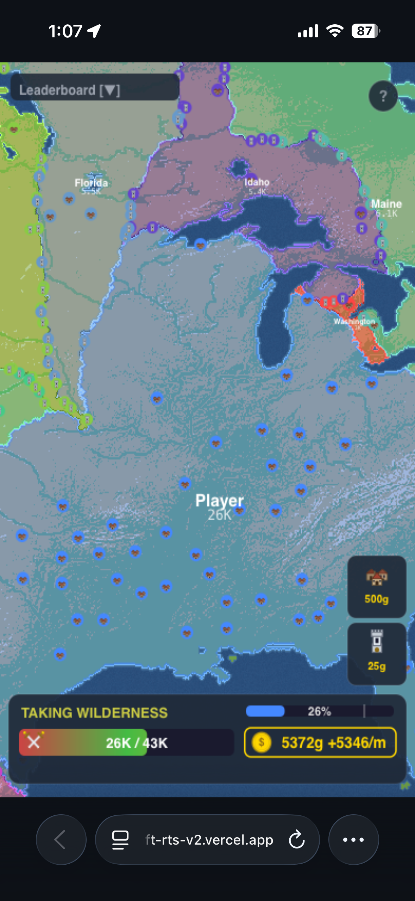

# Meta RTS — Product Requirements Document

## 1. Overview

Meta RTS is a real-time strategy territory-control game running entirely in the browser. The player picks a starting location on a map of the United States, then competes against 20 AI bots to conquer 80% of the continent. The full match takes 5–10 minutes with no install and no signup — instant gameplay designed for a quick strategy fix in a browser tab.

**Product**: Browser-based real-time strategy game
**Stack**: HTML5, CSS3, vanilla JavaScript ES modules, Canvas 2D API, Web Workers. No frameworks, no build step.
**Scope**: Single-page application. No backend, no auth, no persistence.
**Design viewport**: 1440×900 (desktop primary), 390×844 (mobile)
**Content shell**: Full viewport canvas, HUD docked to bottom edge
**Root font size**: `16px` (browser default)

## 2. Design Language

### Colors

| Token | Value | Usage |
|-------|-------|-------|
| `--bg-dark` | `#0a0a0a` | Page background, HUD background |
| `--bg-light` | `#f5f5f0` | Light theme surfaces (unused, dark-only) |
| `--text-primary` | `#ffffff` | Primary text, HUD labels |
| `--text-secondary` | `rgba(255,255,255,0.6)` | Secondary text, metadata |
| `--accent-red` | `#ff4444` | Low troop warning, attack indicators |
| `--accent-green` | `#44ff44` | Optimal troop level, success states |
| `--accent-yellow` | `#ffcc44` | Near-capacity warning |
| `--accent-gold` | `#ffd700` | Gold currency, city icons |
| `--border` | `rgba(255,255,255,0.1)` | HUD borders, dividers |
| `--player-colors` | 21 distinct hues | Per-player territory fills (4-stop gradient per player) |

**Theme**: Dark only. Territory colors use a 4-stop gradient (border → interior) for readable depth.

### Typography

| Role | Font | Size | Weight | Transform |
|------|------|------|--------|-----------|
| Display | System sans-serif | `clamp(2rem, 5vw, 4rem)` | 700 | uppercase |
| HUD Heading | System sans-serif | `14px` | 600 | uppercase |
| HUD Body | System sans-serif | `12px` | 400 | — |
| HUD Label | System sans-serif | `10px` | 500 | uppercase |

System stack: SF Pro (macOS), Segoe UI (Windows), Roboto (Android), sans-serif fallback. No web font loaded.

### Visual Treatments

| Element | Spec |
|---------|------|
| Territory fill | 4-stop radial gradient per player (border color → mid → interior → highlight) for depth without flat color blocks |
| Troop bar | Horizontal gradient red → green → yellow mapped to troop capacity percentage |
| Cloud intro | 60+ procedurally generated radial-gradient puffs drifting outward from center |
| HUD | Fixed bottom bar, `backdrop-filter: blur(10px)`, semi-transparent black, never overlaps gameplay |
| Icons | Hand-authored SVG (city, fort, troop, gold) drawn to canvas via `drawImage` for crisp rendering at any zoom |
| Scrollbar | Hidden (canvas-based, no DOM scroll) |

### Z-Index Stack

`Canvas (map) → HUD (bottom bar) → Modals (victory screen) → Tooltips`

### Interactions

| # | Trigger | Behavior | Duration | Easing |
|---|---------|----------|----------|--------|
| 1 | Click Play | Clouds clear outward, camera zooms to map | 2s | `cubic-bezier(0.165, 0.84, 0.44, 1)` |
| 2 | Click land tile | Claim territory, spawn initial troops | instant | — |
| 3 | Click enemy tile | Launch attack, troops animate toward target | variable | linear per tick |
| 4 | Hover HUD button | Tooltip appears above button | 0.2s | ease-out |
| 5 | Troop bar update | Width and gradient position animate | 0.3s | ease-out |
| 6 | Victory at 80% | Modal scales in with "Victory!" | 0.4s | `cubic-bezier(0.175, 0.885, 0.32, 1.275)` |

### Responsive Breakpoints

| Breakpoint | Changes |
|-----------|---------|
| ≤768px | Touch controls: single-finger pan, tap to attack, two-finger pinch-zoom. HUD buttons enlarge to 44px minimum touch target. |
| ≤480px | HUD condenses to icon-only buttons. Territory percentage and gold move to top bar. |

## 3. Repository Layout

The single source of truth for the routes the site exposes, the files on disk that implement them, and the assets they reference.

```
anujvarma-webcraft-rts-claude/
├── index.html                      ← Single-page game shell
├── style.css                       ← All styles (HUD, modals, layout)
├── game-worker.js                  ← Simulation engine (Web Worker)
├── js/
│   ├── main.js                     ← Entry point, init, game loop
│   ├── renderer.js                 ← Canvas drawing (terrain, territories, HUD)
│   ├── hud.js                      ← HUD state and DOM updates
│   ├── grid.js                     ← Tile grid and coordinate helpers
│   ├── colors.js                   ← Player color palette generation
│   ├── overlays.js                 ← Modal and tooltip rendering
│   ├── tutorial.js                 ← Onboarding overlay logic
│   └── config.js                   ← Game constants and tuning
├── maps/
│   └── usa/
│       ├── map.bin                 ← 1440×810 binary terrain (1 byte/tile)
│       └── manifest.json           ← Map metadata
├── icons/
│   ├── city.svg                    ← City building icon
│   ├── defense_post.svg            ← Fort icon
│   ├── gold.svg                    ← Gold coin icon
│   └── troop.svg                   ← Troop/swords icon
├── tools/
│   ├── generate_map.py             ← Elevation → binary converter
│   ├── build_europe_map.py         ← Europe map builder
│   ├── build_india_map.py          ← India map builder
│   └── build_india_small.py        ← Small India variant
├── screenshots/                    ← PRD reference images
├── vercel.json                     ← Static hosting config
├── package.json                    ← Empty (no dependencies)
├── site.toml                       ← Site metadata
├── PRD.md
└── SETUP.md
```

| Path | Size | Purpose |
|------|------|---------|
| `index.html` | ~1660 lines | Single-page shell with canvas, HUD markup, and inline critical CSS |
| `style.css` | ~450 lines | HUD styles, modal styles, responsive layout, animations |
| `game-worker.js` | ~520 lines | Tile simulation, bot AI, attack resolution, runs off main thread |
| `js/main.js` | ~280 lines | Initialization, input handling, main↔worker messaging |
| `js/renderer.js` | ~340 lines | Canvas draw calls for terrain, territory gradients, icons, animations |
| `js/hud.js` | ~180 lines | Territory %, troop bar, gold counter, build button state |
| `js/grid.js` | ~90 lines | Coordinate conversion, neighbor lookup, bounds checking |
| `js/colors.js` | ~60 lines | 21-player color palette with 4-stop gradient generation |
| `maps/usa/map.bin` | 1.16 MB | Binary terrain data (1440×810 tiles, 1 byte per tile) |
| `icons/*.svg` | 4 files | Hand-authored SVG icons for city, fort, troop, gold |
| `tools/*.py` | 4 files | Offline map preprocessing (Pillow + NumPy) |

**Constraints**: Zero npm dependencies at runtime. Static deploy to Vercel. No build step. Client-side only.

**Performance**: Web Worker simulation keeps main thread at 60fps. Diff-based messaging sends only changed tiles (typically 10–60 per tick vs full 1.16M). `Int32Array` transferables avoid copy overhead. Canvas double-buffering for smooth zoom/pan.

**Browser support**: Chrome/Edge 100+, Firefox 95+, Safari 15+. Requires Canvas 2D, Web Workers, ES modules.

## 4. Page Specifications

### 4.1 Game Page (single route)

| Section | Layout | Content | Behavior |
|---------|--------|---------|----------|
| Intro screen | Full viewport overlay | "Meta RTS" title, "Play" button, subtitle | Click Play triggers cloud-clear animation (2s), then reveals map |
| Map canvas | Full viewport below HUD | 1440×810 tile grid rendered to canvas with pan/zoom | WASD or drag to pan, scroll or pinch to zoom, click to attack/claim |
| HUD bar | Fixed bottom, full width, 64px height | Left: territory % with 80% marker. Center: troop bar (gradient). Right: gold counter, City button, Fort button | Updates every tick. Buttons enable/disable based on gold. Tooltips on hover. |
| Victory modal | Centered overlay | "Victory!" heading, final stats, "Play Again" button | Appears when player reaches 80% territory. Scales in with spring easing. |
| Tutorial overlay | Top-center toast | Contextual hints ("Click land to start", "Click enemy to attack") | Shows on first play, dismisses after action completed |

**Gameplay loop**:
1. Cinematic clouds reveal the map
2. Click anywhere on land to plant starting territory
3. Click unclaimed tiles to take wilderness
4. Click enemy territory to attack — multiple simultaneous attacks supported
5. Spend gold on Cities (+500 troop cap) and Forts (4× enemy attack cost in radius)
6. Reach 80% map control to win

**Bot AI**: 20 bots with three archetypes — aggressive (prioritizes attacks), defensive (prioritizes forts), balanced (mixed). Each runs independent decision loop every ~500ms.

## 5. User Stories

Ordered by dependency: structure → styling → interactivity → polish.

### Phase 1: Structure

| ID | Story | Acceptance |
|----|-------|------------|
| US-1 | Add HTML shell with canvas and HUD markup | Page loads with full-viewport canvas element and bottom HUD bar containing territory %, troop bar, gold, and two build buttons. |
| US-2 | Add Web Worker for simulation | Game logic runs in `game-worker.js`. Main thread stays responsive during simulation. |
| US-3 | Add map binary loader | `maps/usa/map.bin` loads on startup and renders as terrain on canvas. |

### Phase 2: Styling

| ID | Story | Acceptance |
|----|-------|------------|
| US-4 | Style HUD with dark translucent bar | HUD appears as fixed bottom bar with blurred background. Text is white, readable over map. |
| US-5 | Style troop bar with color gradient | Troop bar shows red → green → yellow gradient. Position along gradient matches current troop percentage. |
| US-6 | Style territory with player gradients | Each player's territory renders with 4-stop radial gradient giving visible depth. Borders are distinct from interior. |

### Phase 3: Interactivity

| ID | Story | Acceptance |
|----|-------|------------|
| US-7 | Make cloud intro animate on Play | Clicking Play triggers 60+ cloud puffs drifting outward over 2 seconds to reveal map beneath. |
| US-8 | Make map pannable and zoomable | WASD keys pan the camera. Mouse wheel zooms. Camera clamps to map edges at every zoom level. |
| US-9 | Make tiles clickable to claim and attack | Clicking unclaimed land claims it. Clicking enemy territory launches attack. Multiple attacks can be active simultaneously. |
| US-10 | Make HUD update in real time | Territory percentage, troop bar, and gold counter update every simulation tick without page refresh. |
| US-11 | Make City and Fort buttons build structures | Clicking City button (when affordable) places city on selected tile, increasing troop cap. Fort button places fort, increasing defense cost for enemies in radius. |
| US-12 | Make victory modal appear at 80% | When territory bar reaches the 80% marker, "Victory!" modal scales in with Play Again button. |

### Phase 4: Polish

| ID | Story | Acceptance |
|----|-------|------------|
| US-13 | Add touch support for mobile | Single-finger drag pans, tap attacks, two-finger pinch zooms. HUD buttons are minimum 44px. |
| US-14 | Add tutorial hints for first play | Contextual toasts appear guiding first-time player through starting territory, attacking, and building. Dismiss after action. |
| US-15 | Add 80% threshold marker to territory bar | Vertical white tick mark appears at 80% position on territory progress bar. |
| US-16 | Ensure 60fps during heavy simulation | With 21 players active and ~30 tiles changing per tick, frame rate stays at 60fps on desktop Chrome. |

---

# Appendix: Screenshots



