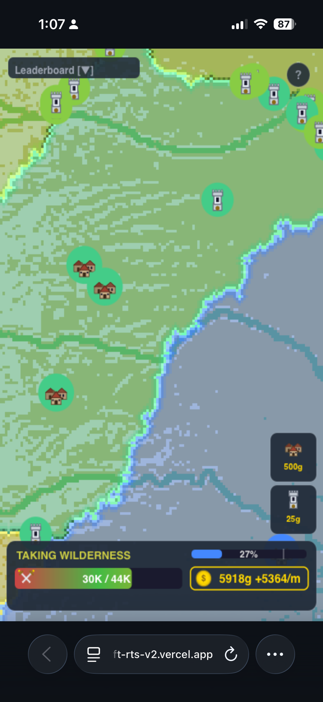
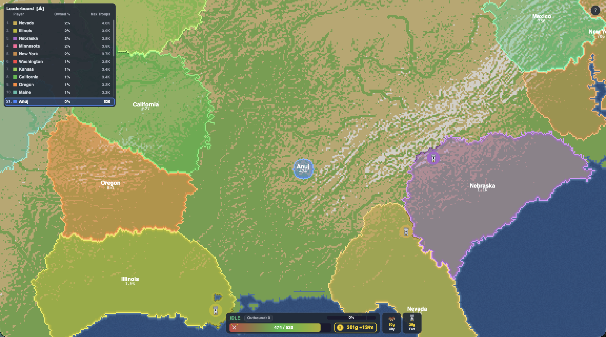

# Meta RTS — Product Requirements Document

**Category:** Game Dev
**Live URL:** https://anujvarma-webcraft-rts-claude.vercel.app
**Repo:** codimango/anujvarma-webcraft-rts-claude

## What it is

Meta RTS is a real-time strategy territory-control game running entirely in the browser. The player picks a starting location on a map of the United States, then competes against 20 AI bots to conquer 80% of the continent. Inspired by titles like OpenFront and Risk, but built from scratch with vanilla web technologies — no game engine, no framework, no build step.

The entire game is roughly 1,700 lines of hand-written JavaScript. Simulation runs in a Web Worker so the main thread stays at 60fps even when ~30 tiles per tick are being claimed across 21 active players.

## Who it's for

Anyone who wants a quick strategy fix in a browser tab — no install, no signup, instant gameplay. The full match takes 5–10 minutes. Designed for desktop primarily, with touch and pinch-zoom support for mobile.

## Why this fits Game Dev

The brief asks for "web-based games built with modern web technologies" and explicitly calls out "physics simulations" and "interactive storytelling." This entry pushes on technical ambition for what a single-file vanilla web game can achieve:

- **~1.16M tile state machine** simulated in real time on a Web Worker
- **Diff-based main↔worker messaging** with `Int32Array` transferables — only changed tiles get sent each tick (typically 10–60 tiles vs the full 1.16M)
- **Bot AI** with three strategy archetypes (aggressive, defensive, balanced) running parallel decision loops
- **Pixel-perfect canvas rendering** at any zoom level using a buffer canvas + per-tile color gradients per player
- **Procedural cloud intro** — 60+ animated cloud puffs with radial gradients, drifting outward to reveal the map

## Design choices

A few decisions were intentional and worth calling out:

**1. Cinematic intro instead of a menu screen.** When the player clicks Play, the camera zooms in while procedurally-generated clouds clear outward from the center. No transition feels more "you've arrived" than this — it sets the stakes before a single tile is placed.

**2. The HUD lives at the bottom and never overlaps gameplay.** All status info (territory progress, troop bar, gold, build buttons) sits in a single bar at the bottom edge so the map stays unobstructed. Tooltips on hover instead of permanent labels — the screen is for the world, not the UI.

**3. Color gradient on the troop bar.** The bar fades from red (low troops, fast regen) → green (sweet spot at ~50% capacity) → yellow (near cap, diminishing returns). The gradient is the math, made visible. No need to read a number to know whether you should attack or wait.

**4. Hand-drawn SVG iconography.** Every icon (city as a cluster of medieval cabins, fort as a watchtower, troop as crossed swords with gold pommels, gold as a coin) was hand-authored in SVG rather than pulled from an icon set. Crisp at every zoom level, themed consistently, and on-brand for a strategy game.

**5. Player territory in vivid color, wilderness muted.** A four-stop blend (border → interior) gives each player territory readable depth without flattening into a solid color block. You can see where someone's about to push.

**6. 80% threshold marker on the territory bar.** A vertical white tick at the 80% point so the player always knows exactly how close victory is — no math required.

## How to run it

```bash
npx serve -l 3000
```

Open `http://localhost:3000`. No build, no install, no env vars. Full setup details in `SETUP.md`.

## Tech stack

- **Vanilla HTML / CSS / JavaScript** — zero frameworks, zero npm dependencies at runtime
- **Canvas 2D API** — all rendering (terrain, HUD, icons, animations)
- **Web Workers** — game simulation off the main thread; main↔worker via `postMessage` with `Int32Array.buffer` transferables
- **SVG icons** — loaded as `Image` and drawn via `ctx.drawImage`
- **Binary map files** — 1 byte per tile (1440×810 = 1.16 MB) decoded into `Uint8Array` on load
- **Hosted on Vercel** as a static site
- **Map preprocessing**: Python + Pillow + NumPy (`tools/`) for offline elevation-data → binary terrain conversion

## Asset sources

- **Map elevation data** — derived from public North America heightmap in OpenFrontIO assets (cropped to continental US + southern Canada + northern Mexico, resampled to 1440×810, repackaged as `maps/usa/map.bin`)
- **All SVG icons** — hand-authored for this project: `icons/city.svg`, `icons/defense_post.svg`, `icons/gold.svg`, `icons/troop.svg`. Multiple alternate concepts also live in `icons/` for reference.
- **Fonts** — system sans-serif (SF Pro on macOS, Segoe UI on Windows, etc.). No web font loaded.
- **No third-party JavaScript libraries** at runtime.

## Responsive design

- **Desktop**: WASD pan, scroll zoom, click to attack, right-click to cancel
- **Mobile**: single-finger pan, tap to attack, two-finger pinch-zoom
- Camera clamps to map edges at every zoom level so the player never sees off-map black
- HUD scales to viewport width

## Gameplay loop summary

1. Cinematic clouds reveal the map
2. Click anywhere on land to plant your starting territory
3. Click unclaimed tiles to take wilderness
4. Click enemy territory to attack — multiple simultaneous attacks supported
5. Spend gold on Cities (+500 troop cap) and Forts (4× enemy cost in radius)
6. Reach 80% map control to win → "Victory!" screen with Play Again button

## Screenshots




